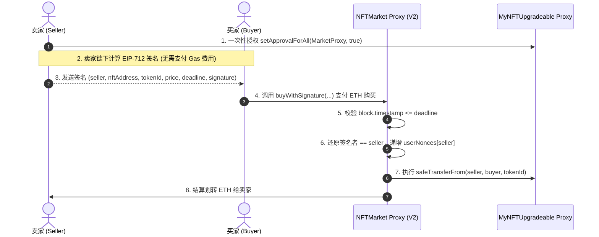

# 第十七课 可升级合约设计部署与存储布局原理解析

本目录包含 **第十七课 (17.1 可升级合约设计与部署)** 与 **(17.2 可升级合约存储布局理解)** 的全部智能合约源码、离线签名逻辑解析、操作步骤说明、Sepolia 测试网部署地址及 17.2 存储布局 Q&A 问答文档：

- **17.1 原理解析与代码架构**: [`Upgradeable_Architecture.md`](file:///Users/a33445566/Developer/project/w3/solidity-rel/upchain_2026/src/D17/Upgradeable_Architecture.md)
- **17.2 存储布局理解 Q&A 问答文档**: [`17.2_Storage_Layout_QnA.md`](file:///Users/a33445566/Developer/project/w3/solidity-rel/upchain_2026/src/D17/17.2_Storage_Layout_QnA.md)

---


## 一、 合约架构与功能概述

1. **`MyNFTUpgradeable.sol` (可升级 ERC721 合约)**:
   - 基于 OpenZeppelin 5.x 推荐的 **UUPS 代理模式** (`ERC721Upgradeable`, `OwnableUpgradeable`, `UUPSUpgradeable`)。
   - 构造函数中使用 `_disableInitializers()` 禁用逻辑合约的初始化，通过 `initialize()` 函数初始化代币名称与 Owner。

2. **`NFTMarketV1.sol` (NFT 市场合约 - 第一版)**:
   - 普通 NFT 挂单与购买市场。
   - `list(address nftAddress, uint256 tokenId, uint256 price)`：卖家在链上挂单。
   - `buyNFT(address nftAddress, uint256 tokenId)`：买家支付 ETH 购买 NFT，资金直接转给卖家，NFT 转移给买家。
   - 包含存储槽留白 `uint256[49] private __gap;` 以保障后续升级安全性。

3. **`NFTMarketV2.sol` (NFT 市场合约 - 第二版)**:
   - 继承 `NFTMarketV1` 与 `EIP712Upgradeable`，严格继承 V1 的存储槽，在末尾追加 `userNonces` 映射。
   - **EIP-712 离线签名上架**：卖家只需一次性调用 `setApprovalForAll` 授权给市场代理合约，后续挂单仅需在链下进行签名，无需发送链上交易。
   - `buyWithSignature(seller, nftAddress, tokenId, price, deadline, signature)`：买家携带卖家的离线签名和 ETH 调用此函数，市场合约验证签名真实性、授权状态与过期时间后自动交割。

---

## 二、 详细操作步骤与执行指令

### 步骤 1：安装依赖与配置 Remappings

安装 OpenZeppelin Upgradeable 可升级合约库：
```bash
forge install openzeppelin/openzeppelin-contracts-upgradeable --no-git
```
在根目录 `remappings.txt` 中添加映射配置：
```
@openzeppelin/contracts-upgradeable/=lib/openzeppelin-contracts-upgradeable/contracts/
```

---

### 步骤 2：编译合约

验证项目能否正常编译：
```bash
forge build
```

---

### 步骤 3：运行本地单元测试与代理升级验证

运行 Foundry 单元测试（测试包含 V1 挂单买卖、UUPS 代理升级至 V2、`vm.sign` 签名撮合交易、签名重放防范与超时防范）：
```bash
forge test --match-contract D17_UpgradeableMarketTest -vvv
```

**测试通过预期输出**：
```
Ran 6 tests for test/D17_UpgradeableMarket.t.sol:D17_UpgradeableMarketTest
[PASS] test_UnauthorizedUpgradeFails()
[PASS] test_UpgradeToV2()
[PASS] test_V1_ListAndBuy()
[PASS] test_V2_BuyWithSignature()
[PASS] test_V2_ExpiredSignatureFails()
[PASS] test_V2_ReplaySignatureFails()
Suite result: ok. 6 passed; 0 failed; 0 skipped
```

---

### 步骤 4：部署至 Sepolia 测试网并开源验证

确保 `.env` 文件配置了 `RPC_URL`、`PRIVATE_KEY` 与 `ETHERSCAN_API_KEY`，然后执行部署与验证脚本：
```bash
forge script script/DeployD17.s.sol:DeployD17Script \
  --rpc-url $RPC_URL \
  --private-key $PRIVATE_KEY \
  --broadcast \
  --verify \
  --etherscan-api-key $ETHERSCAN_API_KEY
```

若独立验证合约源码，可使用：
```bash
# 验证 MyNFTUpgradeable 逻辑合约
forge verify-contract 0xC2d19cE6914E0486852488FF519c3689Edb52614 src/D17/MyNFTUpgradeable.sol:MyNFTUpgradeable --chain 11155111 --etherscan-api-key $ETHERSCAN_API_KEY

# 验证 NFTMarketV1 逻辑合约
forge verify-contract 0xfbDBeF4f3B132A74Ba0C28a0d27F3660ece4711f src/D17/NFTMarketV1.sol:NFTMarketV1 --chain 11155111 --etherscan-api-key $ETHERSCAN_API_KEY

# 验证 NFTMarketV2 逻辑合约
forge verify-contract 0xaF6E3e6eE766620b16338122db9Bd89007a4C894 src/D17/NFTMarketV2.sol:NFTMarketV2 --chain 11155111 --etherscan-api-key $ETHERSCAN_API_KEY
```

---

## 三、 第二版本 (V2) 卖家离线签名上架交互流程



---

## 四、 测试网已部署与开源合约地址列表 (Sepolia)

| 合约角色 | 合约名称 / 描述 | Sepolia 链上地址 | 区块链浏览器链接 |
| :--- | :--- | :--- | :--- |
| **NFT Proxy** | `MyNFTUpgradeable` 代理合约 | `0x5D9D99f78f171CD6FCbfA299027922694495F4c1` | [Etherscan 代理合约](https://sepolia.etherscan.io/address/0x5D9D99f78f171CD6FCbfA299027922694495F4c1) |
| **NFT Impl** | `MyNFTUpgradeable` 逻辑合约 | `0xC2d19cE6914E0486852488FF519c3689Edb52614` | [Etherscan 源码](https://sepolia.etherscan.io/address/0xC2d19cE6914E0486852488FF519c3689Edb52614#code) |
| **Market Proxy** | `NFTMarket` UUPS 代理合约 | `0xD41a8283a9cB44e68772a0AcC4a911689cAba020` | [Etherscan 代理合约](https://sepolia.etherscan.io/address/0xD41a8283a9cB44e68772a0AcC4a911689cAba020) |
| **Market V1 Impl** | `NFTMarketV1` 第一版逻辑合约 | `0xfbDBeF4f3B132A74Ba0C28a0d27F3660ece4711f` | [Etherscan V1 源码](https://sepolia.etherscan.io/address/0xfbDBeF4f3B132A74Ba0C28a0d27F3660ece4711f#code) |
| **Market V2 Impl** | `NFTMarketV2` 第二版逻辑合约（离线签名上架） | `0xaF6E3e6eE766620b16338122db9Bd89007a4C894` | [Etherscan V2 源码](https://sepolia.etherscan.io/address/0xaF6E3e6eE766620b16338122db9Bd89007a4C894#code) |

---

## 五、 `DeployD17.s.sol` 部署脚本详解

Foundry 部署脚本 [`DeployD17.s.sol`](file:///Users/a33445566/Developer/project/w3/solidity-rel/upchain_2026/script/DeployD17.s.sol) 实现了可升级合约架构的自动化部署与原子升级流程。脚本整体执行分为以下 5 个核心阶段：

### 1. 部署账户与广播上下文配置 (第 12 ~ 17 行)
- **私钥读取与地址导出**：`vm.envUint("PRIVATE_KEY")` 从环境变量读取部署者私钥，并通过 `vm.addr(deployerPrivateKey)` 导出公钥地址 `deployer`。
- **开启广播机制**：`vm.startBroadcast(deployerPrivateKey)` 告知 Foundry 后续所有合约创建（`new`）与交易调用，均由部署者私钥签名并广播至目标链。

### 2. 部署可升级 NFT 合约与代理 (第 19 ~ 27 行)
- **部署 Implementation 逻辑合约**：`nftImpl = new MyNFTUpgradeable()`。逻辑合约的构造函数已调用 `_disableInitializers()` 锁定未初始化的状态槽。
- **编码初始化 Data**：利用 `abi.encodeWithSelector(MyNFTUpgradeable.initialize.selector, "Upchain NFT", "UNFT", deployer)` 构造初始化 CallData。
- **部署 ERC1967Proxy**：`new ERC1967Proxy(address(nftImpl), nftInitData)`。代理合约在构造函数中通过 `delegatecall` 触发 `initialize`，将代币名称、符号和初始 Owner 写入代理合约存储。

### 3. 部署 NFTMarketV1 与代理 (第 29 ~ 35 行)
- **部署 V1 逻辑合约**：`marketV1Impl = new NFTMarketV1()`。
- **编码 V1 初始化 Data**：`abi.encodeWithSelector(NFTMarketV1.initialize.selector, deployer)`。
- **部署 Market Proxy**：`marketProxy = new ERC1967Proxy(address(marketV1Impl), marketInitData)`，完成市场合约 V1 代理的初始化。

### 4. 部署 NFTMarketV2 并平滑升级代理 (第 37 ~ 42 行)
- **部署 V2 逻辑合约**：`marketV2Impl = new NFTMarketV2()`。
- **编码重初始化 Data**：`abi.encodeWithSelector(NFTMarketV2.reinitializeV2.selector)`。
- **调用 `upgradeToAndCall` 原子升级**：
  ```solidity
  NFTMarketV1(address(marketProxy)).upgradeToAndCall(address(marketV2Impl), upgradeData);
  ```
  通过代理合约接口调用 `upgradeToAndCall`，底层将代理合约的 ERC-1967 `IMPLEMENTATION_SLOT` 更新指向 V2 逻辑合约地址，并 `delegatecall` 执行 `reinitializeV2()`，将合约版本平滑提升至 V2，同步启用 EIP-712 签名上架功能。

### 5. 链上地址汇总与日志输出 (第 44 ~ 52 行)
- **停止广播**：`vm.stopBroadcast()` 结束交易广播。
- **日志打印**：通过 `console.log` 输出 5 个核心合约地址（2 个 Proxy 代理地址与 3 个 Implementation 逻辑实现地址），便于在 Etherscan 上核验与开源验证。

