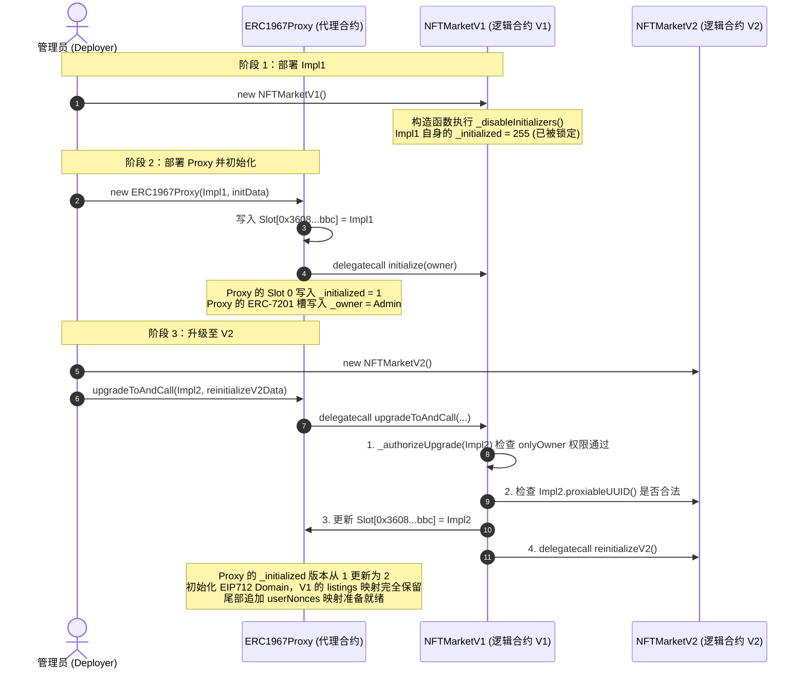

# 可升级智能合约架构原理与测试代码深度解析

本文档包含 Solidity 可升级合约 (UUPS 代理模式) 的**底层 EVM 汇编原理、存储槽数学计算、UUPS 与透明代理对比、生命周期流转**以及 **`D17_UpgradeableMarket.t.sol` 测试代码的逐行精解**。

---

## 第一部分：可升级合约底层原理深度剖析

### 一、 核心底座：EVM 内置指令 `delegatecall`

在以太坊 EVM 中，合约部署后其字节码是**不可篡改 (Immutable)** 的。为了实现逻辑升级，可升级合约采用了**委托调用 (`delegatecall`)** 原理：

| 特性 | 普通调用 `call` | 委托调用 `delegatecall` |
| :--- | :--- | :--- |
| **代码执行方** | 被调用者（目标合约）的代码 | 被调用者（目标合约）的代码 |
| **状态变量读写** | 修改**目标合约**的存储 (Storage) | 修改**调用者（代理合约）**的存储 (Storage) |
| **`msg.sender`** | 变为调用发起方地址 | **保持不变**（仍为最初的用户地址） |
| **`address(this)`** | 目标合约地址 | **保持不变**（仍为代理合约地址） |

#### EVM 汇编层面的转发出

当用户发送交易调用代理合约 `ERC1967Proxy` 时，代理合约内部触发 `fallback()`，底层的 EVM 汇编转发出如下：

```solidity
// OpenZeppelin Proxy.sol 核心汇编实现
assembly {
    // 1. 将用户发来的 calldata 复制到内存 (Memory) pos 0
    calldatacopy(0, 0, calldatasize())

    // 2. 从 ERC-1967 约定槽位读取当前逻辑合约的地址 (impl)
    let impl := sload(0x360894a13ba1a3210667c828492db98dca3e2076cc3735a920a3ca505d382bbc)

    // 3. 执行 delegatecall，用 impl 的代码操作当前 Proxy 的存储
    let result := delegatecall(gas(), impl, 0, calldatasize(), 0, 0)

    // 4. 将逻辑合约返回的数据复制到内存 pos 0
    returndatacopy(0, 0, returndatasize())

    // 5. 根据 delegatecall 的执行结果 (0 表示 revert，1 表示 success) 返回或回滚
    switch result
    case 0 { revert(0, returndatasize()) }
    default { return(0, returndatasize()) }
}
```

---

### 二、 存储布局、数学槽位计算与槽碰撞防护

#### 1. 普通变量存储槽分配 (Solidity 默认规则)
Solidity 按变量声明顺序从 `Slot 0` 开始递增分配：
- 基本数据类型（`uint256`, `address`, `bool`）依次填充 `Slot 0`, `Slot 1`...
- 映射 `mapping(key => value)`：变量本身只占一个槽位 `S`。某个特定 `key` 的值存储在：
  $$\text{Slot}_{\text{value}} = \text{keccak256}(\text{abi.encode}(key, S))$$
- 动态数组 `T[]`：槽位 `S` 存储数组长度。具体元素存储在 `keccak256(S) + index`。

#### 2. ERC-1967 逻辑合约地址存储槽
代理合约自身必须保存“逻辑合约地址”。为了防止与逻辑合约中的 `Slot 0` 变量产生碰撞，**ERC-1967** 规定了一个通过伪随机哈希计算出的特定 Slot：

$$\text{IMPLEMENTATION\_SLOT} = \text{keccak256}("eip1967.proxy.implementation") - 1$$

计算结果为：`0x360894a13ba1a3210667c828492db98dca3e2076cc3735a920a3ca505d382bbc`。

#### 3. OpenZeppelin 5.x 的 ERC-7201 命名空间存储 (Namespaced Storage Layout)
在 OpenZeppelin 5.x 中，基类合约（如 `OwnableUpgradeable`）采用了 **ERC-7201** 标准，将变量封存在独立算出的哈希槽位：

$$\text{Slot}_{\text{Ownable}} = \text{keccak256}(\text{abi.encode}(\text{uint256}(\text{keccak256}("openzeppelin.storage.Ownable")) - 1)) \& \sim\text{bytes32}(0xff)$$

这样即便未来给父类合约添加新变量，也不会破坏子类合约的存储槽布局。

---

### 三、 UUPS 与透明代理 (Transparent Proxy) 的底层机制对比

#### 1. 函数选择器冲突问题 (Function Selector Clash)
在 EVM 中，调用的函数是由 `msg.data` 前 4 字节的函数选择器（`bytes4(keccak256("func()"))`）决定的。如果管理员的升级函数与普通用户的业务函数选择器发生碰撞，透明代理需要引入额外的 `admin` 检查。

#### 2. 透明代理 vs UUPS 差异

```
                ┌─── 透明代理 (Transparent Proxy)：升级逻辑放在 Proxy 合约中（每次调用增加判断 SLOAD）
代理模式分类 ───┤
                └─── UUPS 代理 (Universal Upgradeable Proxy Standard)：升级逻辑放在 Implementation 合约中（省 Gas、更安全）
```

- **透明代理**：Proxy 内部保存管理员检查逻辑，普通用户每次调用都要多出一次 SLOAD 读取 `admin` 的 Gas 开销。
- **UUPS**：Proxy 只有 `fallback()`。升级函数 `upgradeToAndCall` 写在 Implementation 中。普通用户调用时无任何额外 Gas 损失。

---

### 四、 一次完整 UUPS 部署与升级的生命周期与存储状态流转



---

### 五、 常见安全漏洞与防范原则

1. **未禁用逻辑合约初始化的黑客攻击（如 Parity 钱包事件）**：
   - 逻辑合约若未在 `constructor` 中调用 `_disableInitializers()`，黑客可以直接调用逻辑合约本身的 `initialize()` 成为 owner 并调用 `selfdestruct` 销毁逻辑合约。
   - **防范**：所有 Upgradeable 逻辑合约的构造函数中必须加上 `_disableInitializers();`。
2. **存储槽错位 (Storage Collision)**：
   - **防范**：升级时新变量只增不减、只在末尾追加，或者在 V1 中使用 `uint256[49] private __gap;` 预留槽位空间。
3. **忘记在升级函数中加权限控制**：
   - **防范**：必须声明 `_authorizeUpgrade(address) internal override onlyOwner {}`。

---

## 第二部分：`D17_UpgradeableMarket.t.sol` 测试源码逐行解析

### 1. 开头声明与依赖导入 (第 1 ~ 9 行)
- **1 ~ 2 行**：指定 MIT 协议及编译器版本 `^0.8.20`。
- **4 行**：导入 `forge-std/Test.sol` 的 `Test` 基类和 `console` 打印工具。
- **5 行**：导入 OpenZeppelin 的 `ERC1967Proxy` 代理合约。
- **6 ~ 8 行**：导入被测试合约 `MyNFTUpgradeable`、`NFTMarketV1` 和 `NFTMarketV2`。

### 2. 状态变量与测试环境设置 (第 10 ~ 38 行)
- **10 ~ 13 行**：定义测试合约 `D17_UpgradeableMarketTest` 继承自 `Test`，声明 `nftProxy`、`marketV1Proxy`、`marketV2Proxy` 接口指针。
- **15 ~ 18 行**：定义 `owner`（即 `address(this)`）、卖家的私钥 `sellerPrivateKey = 0xA11CE`、卖家地址 `seller` 和买家地址 `buyer`。
- **20 ~ 21 行**：`setUp()` 初始化函数，使用 `vm.addr(sellerPrivateKey)` 算出卖家以太坊地址。
- **23 ~ 27 行**：部署 `MyNFTUpgradeable` 逻辑合约，生成 `initialize("Upchain NFT", "UNFT", owner)` 的 Calldata 并部署 `ERC1967Proxy` 代理合约。
- **29 ~ 33 行**：部署 `NFTMarketV1` 逻辑合约与 `ERC1967Proxy` 代理合约。
- **35 ~ 38 行**：使用 `vm.deal` 给卖家和买家注入 10 ETH 测试资金。

### 3. V1 基础挂单与购买测试 `test_V1_ListAndBuy()` (第 40 ~ 64 行)
- **42 行**：铸造 `tokenId` 为 1 的 NFT 给 `seller`。
- **44 ~ 47 行**：切换身份为 `seller`，调用 `setApprovalForAll` 给代理市场授权，并调用 `list` 挂单（价格 `1 ether`）。
- **49 ~ 52 行**：读取链上 `listings` 映射，断言挂单卖家、价格及 `active == true` 状态。
- **54 ~ 57 行**：记录卖家余额，切换身份为 `buyer`，附带 `1 ether` 调用 `buyNFT`。
- **59 ~ 63 行**：断言 NFT 拥有者变为 `buyer`，卖家余额增加 `1 ether`，挂单标记为 `active == false`。

### 4. UUPS 代理升级测试 `test_UpgradeToV2()` (第 66 ~ 79 行)
- **68 行**：部署 V2 逻辑实现合约 `NFTMarketV2`。
- **71 ~ 72 行**：生成 `reinitializeV2()` 的 Calldata，管理员调用 `upgradeToAndCall` 将代理合约原子升级至 V2 逻辑合约并执行初始化。
- **74 行**：强转代理合约指针为 `NFTMarketV2`。
- **77 ~ 78 行**：断言 V2 新增的 `userNonces` 状态与 `LISTING_TYPEHASH` 常量可用。

### 5. EIP-712 离线签名上架与买家核验购买测试 `test_V2_BuyWithSignature()` (第 81 ~ 126 行)
- **83 行**：先执行 `test_UpgradeToV2()` 确保代理已升级至 V2。
- **86 行**：铸造 `tokenId` 为 2 的 NFT 给 `seller`。
- **89 ~ 90 行**：卖家一次性 `setApprovalForAll` 授权给市场代理。
- **92 ~ 94 行**：定义上架参数：价格 `0.5 ether`，超时时间 `1 hours`，获取卖家当前 `nonce = 0`。
- **97 ~ 104 行**：调用 V2 合约获取 EIP-712 摘要 `digest`。
- **106 ~ 107 行**：使用 `vm.sign(sellerPrivateKey, digest)` 签发 `v, r, s` 并打包拼接成 65 字节签名 `signature`。
- **112 ~ 120 行**：买家调用 `buyWithSignature` 附带 `0.5 ether` 传入签名提交交易。
- **123 ~ 125 行**：断言买家成功收到 NFT，卖家收到 ETH，且 `userNonces[seller]` 增加为 1。

### 6. 签名重放攻击防护测试 `test_V2_ReplaySignatureFails()` (第 128 ~ 160 行)
- **129 ~ 147 行**：在卖家 `nonce` 变为 1 后，故意使用过期的 `nonce = 0` 构造签名。
- **150 ~ 159 行**：使用 `vm.expectRevert("Invalid signature")` 捕获重放攻击拦截，交易被成功回滚。

### 7. 签名过期拦截测试 `test_V2_ExpiredSignatureFails()` (第 162 ~ 195 行)
- **170 行**：故意将签名超时时间设置为过去的时间（`block.timestamp - 1`）。
- **186 ~ 194 行**：使用 `vm.expectRevert("Signature expired")` 捕获超时拦截。

### 8. 非法升级权限拦截测试 `test_UnauthorizedUpgradeFails()` (第 197 ~ 205 行)
- **201 ~ 203 行**：模拟非管理员地址 `buyer` 调用 `upgradeToAndCall` 尝试篡改逻辑合约地址，被 `onlyOwner` 权限成功拦截。

---

## 第三部分：`DeployD17.s.sol` 部署脚本逐行精解

本部分对 Foundry 部署脚本 [`DeployD17.s.sol`](file:///Users/a33445566/Developer/project/w3/solidity-rel/upchain_2026/script/DeployD17.s.sol) 的代码逻辑与 EVM 部署流程进行逐行解析。

### 1. 基础导入与合约定义 (第 1 ~ 10 行)
- **4 行**：导入 `Script` 基类与 `console` 打印模块。
- **5 行**：导入 OpenZeppelin 标准 `ERC1967Proxy` 代理合约。
- **6 ~ 8 行**：导入待部署的 `MyNFTUpgradeable`、`NFTMarketV1` 以及 `NFTMarketV2` 逻辑合约。
- **10 行**：定义 `DeployD17Script` 继承自 `Script`。

### 2. 部署环境与广播配置 (第 11 ~ 17 行)
- **12 行**：`uint256 deployerPrivateKey = vm.envUint("PRIVATE_KEY");` 提取配置文件或 `.env` 中的部署私钥。
- **13 行**：`address deployer = vm.addr(deployerPrivateKey);` 从私钥推导以太坊部署地址。
- **15 行**：打印部署者公钥地址。
- **17 行**：`vm.startBroadcast(deployerPrivateKey);` 开启全局交易广播，后续的 `new` 操作和交易调用都会生成带有 EIP-155 / EIP-1559 签名的真实交易上链。

### 3. 可升级 NFT 部署与初始化 (第 19 ~ 27 行)
- **20 行**：`MyNFTUpgradeable nftImpl = new MyNFTUpgradeable();` 部署 NFT 逻辑实现合约。注意：逻辑合约自身 `constructor` 中有 `_disableInitializers()`，其存储槽中的 `_initialized` 被锁定为 `255`。
- **21 ~ 26 行**：通过 `abi.encodeWithSelector` 构造初始化 Calldata：
  - Selector 为 `MyNFTUpgradeable.initialize.selector`。
  - 参数包含名称 `"Upchain NFT"`、符号 `"UNFT"` 及管理员 `deployer`。
- **27 行**：`ERC1967Proxy nftProxy = new ERC1967Proxy(address(nftImpl), nftInitData);`
  - 代理合约在构造函数中把 `IMPLEMENTATION_SLOT` 设置为 `address(nftImpl)`。
  - 触发 `delegatecall(nftInitData)`，在代理合约的存储槽内完成 `ERC721` 名称、符号和 `Ownable` 管理员的写入。

### 4. NFT 市场 V1 部署与初始化 (第 29 ~ 35 行)
- **30 行**：`NFTMarketV1 marketV1Impl = new NFTMarketV1();` 部署 V1 逻辑合约。
- **31 ~ 34 行**：构造 `NFTMarketV1.initialize.selector` Calldata 并传入 `deployer`。
- **35 行**：`ERC1967Proxy marketProxy = new ERC1967Proxy(address(marketV1Impl), marketInitData);` 部署市场代理合约并完成 V1 初始化。

### 5. 市场 V2 部署与原子升级 (第 37 ~ 42 行)
- **38 行**：`NFTMarketV2 marketV2Impl = new NFTMarketV2();` 部署 V2 逻辑实现合约。
- **41 行**：`bytes memory upgradeData = abi.encodeWithSelector(NFTMarketV2.reinitializeV2.selector);` 构造 V2 的 `reinitializeV2()` 调用的 Calldata（版本号设为 2，并初始化 EIP-712 Domain 标识）。
- **42 行**：`NFTMarketV1(address(marketProxy)).upgradeToAndCall(address(marketV2Impl), upgradeData);`
  - 以 `NFTMarketV1` 接口指针指向 `marketProxy` 地址。
  - 调用 `upgradeToAndCall`，代理合约底层会将 `IMPLEMENTATION_SLOT` 从 `marketV1Impl` 更新为 `marketV2Impl`。
  - 同时以 `delegatecall` 触发 `reinitializeV2()`，实现逻辑与状态的无缝升版。

### 6. 部署日志输出与资源回收 (第 44 ~ 53 行)
- **44 行**：`vm.stopBroadcast();` 结束广播模式。
- **46 ~ 52 行**：格式化输出 5 个合约地址（NFT Proxy、NFT Impl、Market Proxy、Market V1 Impl、Market V2 Impl），作为链上开箱测试及 Etherscan 验证的索引依据。

