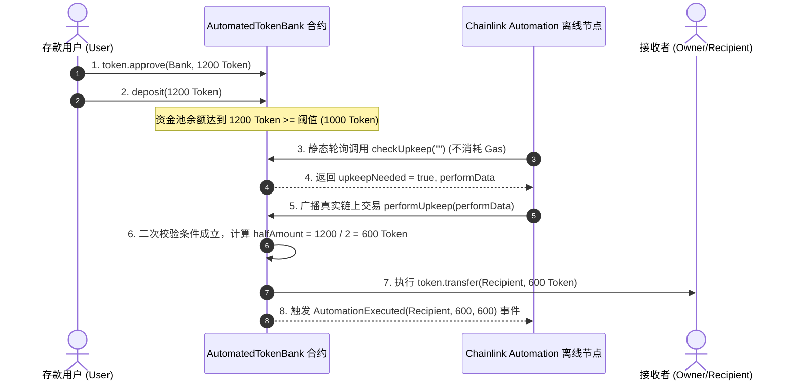

# 第十九课 自动化工作流与 Oracles - AutomatedTokenBank 操作指南与原理解析

本文档包含 **第十九课 (自动化工作流与 Oracles)** 的智能合约架构解析、Chainlink Automation (Keepers) 与 Gelato 接入流程说明及 Foundry 测试验证指令。

---

## 一、 核心功能与自动化工作流概述

智能合约本身是被动的（只有在受到外部交易触发时才会执行指令）。为了实现**“当存款总额超过阈值 $x$ 时自动转移 50% 资产至指定地址”**的业务需求，必须接入**离链自动化网络（Automation Networks / Oracles）**。

### 1. 合约核心架构 (`AutomatedTokenBank.sol`)
- **ERC20 存款机制**：用户通过 `token.approve(bankAddress, amount)` 预先授权，再调用 `deposit(amount)` 存入代币并计入个人账本。
- **Chainlink Automation 标准接口**：
  - `checkUpkeep(bytes calldata checkData)`：离链节点以零 Gas 消费轮询监测合约代币总余额 `token.balanceOf(address(this))` 是否超过设定阈值 `thresholdX`。若满足条件，返回 `upkeepNeeded = true`。
  - `performUpkeep(bytes calldata performData)`：由 Chainlink 自动发起的链上交易，执行二次安全校验后计算出 50% 的余额（`totalBalance / 2`），自动划转给 `recipient`（如 Owner 地址），并触发 `AutomationExecuted` 事件。
- **Gelato 兼容接口**：`checker()` 接口兼容 Gelato Web3 Functions 离线轮询架构。

---

## 二、 自动化触发流程图 (Mermaid Sequence Diagram)



---

## 三、 实战部署与 Chainlink Automation 接入流程

若需将此合约部署至 Sepolia 测试网并挂载自动化触发器，操作步骤如下：

### 1. 部署合约到 Sepolia 测试网
```bash
forge create --rpc-url $RPC_URL \
  --private-key $PRIVATE_KEY \
  src/D19/AutomatedTokenBank.sol:AutomatedTokenBank \
  --constructor-args <ERC20_TOKEN_ADDRESS> <THRESHOLD_IN_WEI> <RECIPIENT_ADDRESS>
```

### 2. 在 Chainlink Automation 平台创建 Upkeep 注册
1. 访问 [Chainlink Automation App](https://automation.chain.link/) 并连接钱包（Network选择 Sepolia）。
2. 点击 **"Register new Upkeep"**：
   - **Trigger type**: 选择 `Custom logic`（自定义逻辑）。
   - **Target contract address**: 填入部署的 `AutomatedTokenBank` 代理或合约地址。
   - **Upkeep name**: 自定义名称（如 `AutomatedTokenBank-AutoTransfer`）。
   - **Gas limit**: 建议设置为 `500,000`。
   - **Starting balance (LINK)**: 存入少量 LINK Token（如 5 LINK）作为支付给自动化节点的利息/手续费。
3. 注册完成后，Chainlink 离线节点将自动开始轮询 `checkUpkeep`。一旦用户存款导致持仓超过 `thresholdX`，Chainlink 将会自动发起链上划转交易。

---

## 四、 Foundry 单元测试验证

运行以下命令执行全流程自动化单元测试：

```bash
forge test --match-contract D19_AutomatedBankTest -vvv
```

### 测试用例覆盖
```
Ran 7 tests for test/D19_AutomatedBank.t.sol:D19_AutomatedBankTest
[PASS] test_AdminConfig() (gas: 32351)
[PASS] test_CheckUpkeep_ReturnsFalseWhenUnderThreshold() (gas: 88361)
[PASS] test_CheckUpkeep_ReturnsTrueWhenThresholdMet() (gas: 88628)
[PASS] test_DepositWithApprove_Success() (gas: 85562)
[PASS] test_GelatoCheckerCompatibility() (gas: 88413)
[PASS] test_PerformUpkeep_ExecutesAutomatedTransfer() (gas: 181025)
[PASS] test_PerformUpkeep_RevertsWhenUnderThreshold() (gas: 90748)
Suite result: ok. 7 passed; 0 failed; 0 skipped
```

- **`test_CheckUpkeep_ReturnsFalseWhenUnderThreshold`**：验证存款未达阈值时，不触发自动化。
- **`test_CheckUpkeep_ReturnsTrueWhenThresholdMet`**：验证存款达到/超越阈值时，`checkUpkeep` 准确识别并返回 `true`。
- **`test_PerformUpkeep_ExecutesAutomatedTransfer`**：验证执行自动化划转后，接收者准确收到 50% 代币，剩余 50% 代币安全存放在银行合约中。
